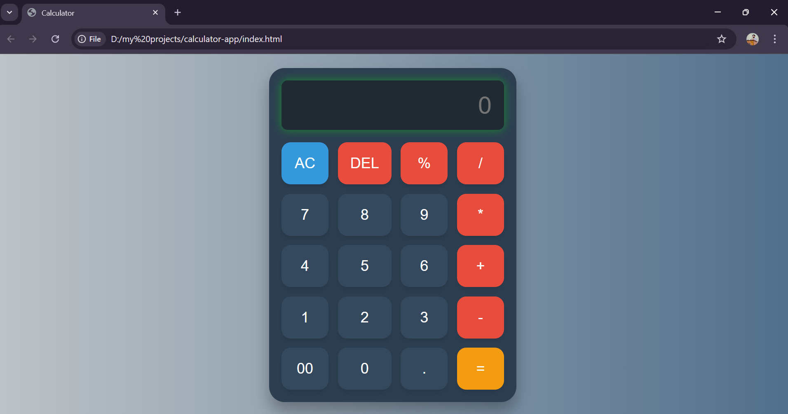

# Calculator Project

## Description
This project is a web-based calculator that allows users to perform basic arithmetic operations such as addition, subtraction, multiplication, and division. The calculator is fully responsive, includes a custom logo, and provides error handling for invalid operations. It was created as a practice project to enhance my understanding of JavaScript and DOM manipulation.

## Technologies Used
- HTML5
- CSS3 (Flexbox and Media Queries for responsiveness)
- JavaScript (DOM manipulation)

## Features
- Perform basic arithmetic operations (addition, subtraction, multiplication, and division)
- Clear the screen with an "AC" button
- Delete the last character with a "DEL" button
- Shows "Error" for invalid inputs like division by zero
- Responsive design that adapts to different screen sizes
- Custom logo and user-friendly interface

## Screenshots

